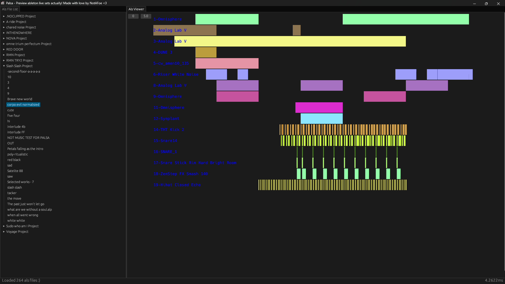

# 🚧 **UNDER CONSTRUCTION** 🚧
## HI if you want an interface to preview ableton projects, specifically their als files, this may be for you!

### *Currently Palsa has no option to direct scanning of specific directories so the default one must be used!*

### Some *screenshots* :)

Palsa has a sidepanel which allows the user to access an als file from their different projects

A *prototypey* preview panel which has controls for scrubbing right as well as zooming in

